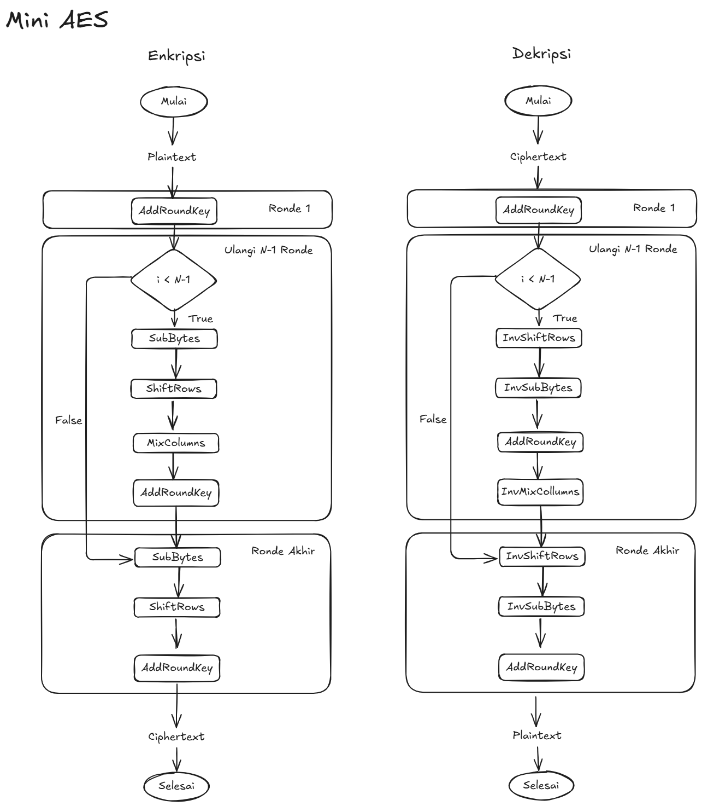
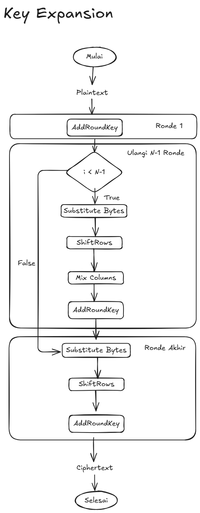

# Midterm Project (Mini-AES)

Kelas       : Kriptografi A

Project			: Mini-AES

Kelompok		: Kelompok 9

Anggota Kelompok:

| Nama | NRP |
| --- | --- |
| Gloriyano Daniel Cristho Pepuho | 5025201121 |
| Urdhanaka Aptanagi | 5025211123 |
| Immanuel Pascanov Samosir | 5025211257 |
| Muhammad Arkan K D | 5025211236 |
| Yehezkiel Wiradhika | 5025201086 |

--- 
> Note: just tmp, delete later

Dokumentasi (15 poin) – Github

- [x]  Spesifikasi algoritma Mini-AES (5)
- [x]  Flowchart Mini-AES dan Key Expansion (5)
- [ ]  Implementasi program
- [ ]  Penjelasan TestCase
- [ ]  Analisis: kelebihan dan keterbatasan Mini-AES (5)
---

## Spesifikasi Algoritma Mini-AES

AES (Advanced Encryption Standard) adalah algoritma kriptografi blok yang kuat namun kompleks. Untuk keperluan pembelajaran,  Mini-AES dirancang sebagai versi ringkas yang  tetap mempertahankan struktur inti AES seperti SubBytes, ShiftRows, MixColumns, dan  AddRoundKey, namun dengan ukuran blok dan kunci yang lebih kecil. Project ini bertujuan untuk memberikan pemahaman praktis tentang bagaimana cipher modern bekerja dalam  bentuk yang sederhana. 

Berikut merupakan spesifikasinya:

### A. Spesifikasi Dasar

1. Implementasi Mini-AES 16-bit
    - Representasi plaintext dan key: 16-bit (4 nibble)
    - Operasi meliputi:
        - SubNibbles (menggunakan S-Box 4-bit)
        - ShiftRows
        - MixColumns (dengan matriks sederhana pada GF(24))
        - AddRoundKey
    - Jumlah round: 3
    - Bahasa pemrograman bebas (Python direkomendasikan)
2. Key Expansion (Round Key Generator)
    - Key awal: 16-bit
    - Algoritma key expansion sederhana untuk menghasilkan round keys
3. Program
    - Menerima Input: Plaintext (16-bit) dan key (16-bit)
    - Mengeluarkan Output: Ciphertext (16-bit)
    - Minimal 3 test case dengan expected output benar
    - Tampilkan *output* proses tiap round
    - Memiliki GUI, menggunakan Tkinter, Streamlit (web-based), dsb
4. Dokumentasi ****– Github
    - Spesifikasi algoritma Mini-AES
    - Flowchart Mini-AES dan Key Expansion
    - Implementasi program
    - Penjelasan TestCase
    - Analisis: kelebihan dan keterbatasan Mini-AES

### B. Spesifikasi Tambahan

1. Implementasi Dekripsi Mini-AES
    - Tambahkan fungsi dekripsi
    - Implementasi inverse operations:
        - Inverse S-Box
        - Inverse MixColumns
        - Inverse ShiftRows
    - Output dekripsi harus menghasilkan kembali plaintext awal
2. Analisis Keamanan dan Avalanche Effect
    - Uji sensitivitas terhadap perubahan 1-bit di plaintext atau key
    - Jelaskan efek avalanche (bit perubahan pada ciphertext)
3. Mode Operasi Blok (ECB/CBC)
    - Tambahkan implementasi mode operasi blok:
        - ECB (Electronic Codebook)
        - CBC (Cipher Block Chaining) lengkap dengan simulasi IV (Initialization Vector).
    - Mendukung input teks lebih panjang dari 16-bit (contoh: 64-bit diproses sebagai 4 blok).
    - Proses enkripsi/dekripsi harus mempertahankan mode
4. Export dan Import File
    - Simpan **input/output dan log proses** ke file TXT/CSV
    - Load file untuk proses enkripsi/dekripsi

## Flowchart Mini-AES dan Key Expansion

### Flowchart Enkripsi dan Dekripsi Mini-AES



### Flowchart Key Expansion



## Penjelasan Implementasi program

Untuk menjalankan program:

```sh
$ python -m venv .venv
$ source .venv/bin/activate
```

```sh
$ pip install -r requirements.txt
```

```sh
$ python main.py
```

Untuk menjalankan Avalanche Test:

```sh
$ python mini_aes_avalanche.py
```

## Penjelasan TestCase

## Analisis: kelebihan dan keterbatasan Mini-AES